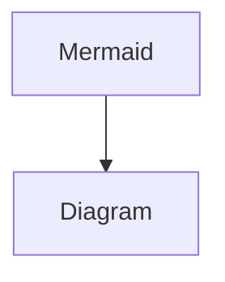

# diagram

```mermaid
graph Example
  Alice -> Bob: Authentication Request
  Bob --> Alice: Authentication Response

  Alice -> Bob: Another authentication Request
  Bob --> Alice: Another authentication Response
```


