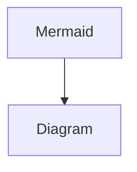

# diagram

<pre class="language-mermaid"><code class="lang-mermaid">graph Example
<strong>  Alice -> Bob: Authentication Request
</strong>  Bob --> Alice: Authentication Response

  Alice -> Bob: Another authentication Request
  Bob --> Alice: Another authentication Response
</code></pre>

